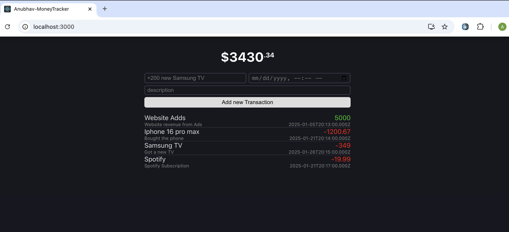

# My Money Tracker

My Money Tracker is a MERN (MongoDB, Express.js, React, Node.js) stack-based application that allows users to manage their finances efficiently. Users can input an amount with a description, and the application stores this data in the database for future reference.

## Features

- Add transaction details with amount and description.
- View all stored transactions.
- Backend powered by Express.js and MongoDB.
- Frontend developed using React for a dynamic and responsive user interface.

## Technologies Used

- **Frontend:** React, CSS
- **Backend:** Node.js, Express.js
- **Database:** MongoDB
- **Version Control:** Git
- **Environment Variables:** Managed using `.env`

## Installation and Setup

To get the project running on your local machine:

### Prerequisites

Ensure you have the following installed:

- Node.js (v14 or above)
- MongoDB (local or cloud instance)
- Git

### Steps

1. **Clone the Repository**:

   ```bash
   git clone <repository-url>
   cd my-money-tracker
   ```

2. **Install Dependencies**:
   Navigate to the backend (`api`) and frontend (`src`) directories, and run the following commands:

   ```bash
   # Install backend dependencies
   cd api
   npm install

   # Install frontend dependencies
   cd ../src
   npm install
   ```

3. **Set Up Environment Variables**:
   Create a `.env` file in the `api` directory and add the following variables:

   ```env
   MONGO_URI=<your-mongodb-connection-string>
   PORT=5000
   ```

4. **Run the Application**:
   Open two terminals to run the backend and frontend servers:

   **Backend**:

   ```bash
   cd api
   npm start
   ```

   **Frontend**:

   ```bash
   cd src
   npm start
   ```

5. **Access the App**:
   Visit `http://localhost:3000` in your browser.

## Folder Structure Overview

### Backend (`api`):

- **`index.js`**: Entry point for the backend.
- **`models`**: Contains Mongoose schemas and models.
- **`.env`**: Holds environment variables.

### Frontend (`src`):

- **`App.js`**: Main React component.
- **`index.js`**: Entry point for the React app.
- **`App.css`**: Styling for the app.
- **Additional Files**: Test files, setup scripts, and assets like `logo.svg`.

## Future Enhancements

- Add user authentication for personalized transaction management.
- Implement data visualization for spending insights.
- Add support for multiple currencies.
- Create a mobile-friendly version of the app.

## Contributing

Contributions are welcome! Feel free to fork this repository, make changes, and submit a pull request.

## License

This project is licensed under the MIT License. See the LICENSE file for details.

## Sample Screenshot

Below is a sample screenshot of the My Money Tracker app:

